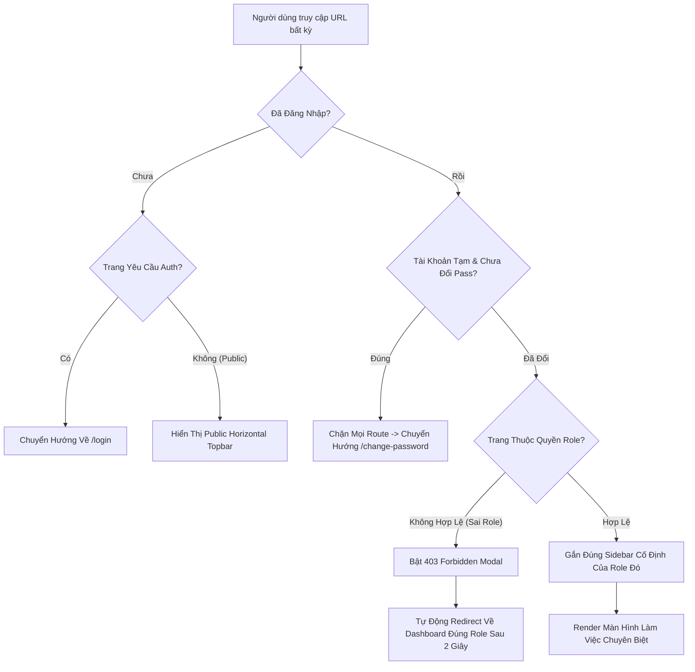

# SEAL FRONTEND — SCREEN ROUTING & ROLE-BASED NAVIGATION ARCHITECTURE
> **Tài liệu Đặc Tả Điều Hướng Màn Hình, Phân Quyền & Quy Chuẩn Giao Diện Theo Vai Trò (Actors)**  
> **Dự án**: SEAL (Student Engagement & Academic League) — Hệ thống Quản trị & Thi đấu RBL / Hackathon  
> **Repository**: `seal-fe` | **Framework**: Next.js 16 (App Router + Turbopack)  

---

## 1. NGUYÊN TẮC THIẾT KẾ ĐIỀU HƯỚNG & PHÂN QUYỀN (CORE PRINCIPLES)

1. **Cô lập Dashboard theo Vai trò (Dashboard Isolation)**:
   - Mỗi Actor/Role khi đăng nhập **chỉ được truy cập và nhìn thấy Dashboard thuộc thẩm quyền của mình**.
   - Mọi nỗ lực truy cập chéo sang Dashboard của Role khác (ví dụ: Judge cố truy cập `/admin/*` hoặc Coordinator cố truy cập `/judge/scoring`) sẽ bị chặn bởi `RoleGuard` và tự động Redirect về đúng Dashboard của Role đó kèm thông báo 403.
2. **Thanh Navigation Bar / Sidebar Cố Định Theo Từng Role (Dedicated Navigation Shell)**:
   - **Tuyệt đối không dùng chung một thanh Navigation hỗn tạp cho các Role khác nhau**.
   - Mỗi Role sở hữu một **Thanh Sidebar Dashboard dọc (Vertical HUD Shell)** cố định riêng với bộ màu nhận diện (Color Palette Tokens), biểu tượng (Badge), và cây menu chức năng chuyên biệt.
3. **Tái sử dụng View nhưng Không dùng chung Nav (Shared Views with Contextual Shell)**:
   - Những màn hình mang tính dùng chung (như *Khám phá Sự kiện, Chi tiết Thể lệ Sự kiện, Bảng Xếp Hạng, Hồ sơ Cá nhân, Đổi Mật Khẩu*): Tái sử dụng chung mã nguồn View (`EventDetailView`, `LeaderboardView`, `UserProfileView`), nhưng **vẫn giữ nguyên Sidebar Dashboard của Role hiện hành** khi đang trong phiên làm việc.

---

## 2. MA TRẬN PHÂN QUYỀN VÀ BẢNG MÀU NHẬN DIỆN ROLE

| STT | Actor / Vai trò | Phân loại | URL Dashboard Chính | Bộ Màu Nhận Diện | Navigation Shell |
| :--- | :--- | :--- | :--- | :--- | :--- |
| **1** | **Executive System Admin** | System Role | `/admin/dashboard` | 🔴 **Crimson / Danger Red** (`#ef4444`) | `Admin Sidebar` (Quản trị hệ thống) |
| **2** | **Event Coordinator (BTC)** | Event Role | `/coordinator/dashboard` | 🟣 **Electric Purple** (`#a855f7`) | `Coordinator Sidebar` (Điều hành sự kiện) |
| **3** | **Judge (Giám Khảo)** | Event Role | `/judge/scoring` | 🟡 **Amber Gold** (`#f59e0b`) | `Judge Sidebar` (Chấm điểm & Đánh giá) |
| **4** | **Mentor (Cố Vấn)** | Event Role | `/mentor/tracks` | 🟢 **Teal / Mint Cyan** (`#2dd4bf`) | `Mentor Sidebar` (Hướng dẫn & Góp ý) |
| **5** | **Team Leader / Member (Thí Sinh)** | Event Role / Student | `/my-team` | 🔵 **Neon Cyan / Blue** (`#00d9ff`) | `Participant Sidebar` / Team Workspace |
| **6** | **Khách / Chưa Đăng Nhập (Guest)** | Public | `/` hoặc `/events` | ⚪ **Zinc Slate / Neutral** | `Public Horizontal Topbar` |

---

## 3. ĐẶC TẢ CHI TIẾT THANH NAVIGATION CỦA TỪNG ACTOR

### 3.1. Executive System Admin (`Admin Sidebar` — Màu Đỏ Crimson)
- **Vị trí**: Cố định bên trái màn hình (`fixed left-0 top-0 bottom-0 w-64`).
- **Badge nhận diện**: `[🔴 SYSTEM ADMIN]`
- **Cây Menu chức năng cố định**:
  1. **Tổng Quan Sự Kiện & Dashboard**: `/admin/dashboard` (Giám sát chỉ số toàn hệ thống, danh sách sự kiện toàn cục, phân công nhanh EC).
  2. **Quản Lý Tài Khoản**: `/admin/users` (Duyệt cán bộ, sinh viên, gán quyền Admin/Cán bộ, khóa/mở tài khoản).
  3. **Danh Mục Trường Học**: `/admin/schools` (Quản lý các cơ sở Đại học FPT và trường đối tác).
  4. **Giám Sát Đội Thi Toàn Hệ Thống**: `/coordinator/teams` (Truy cập nhanh danh sách đội thi đa sự kiện).
  5. **Điều Hành Phê Duyệt**: `/coordinator/dashboard` (Giám sát luồng điều hành chung).
  6. **Tạo Sự Kiện Mới (Wizard)**: `/admin/events/new` (Khởi tạo sự kiện mới, thiết lập ban đầu).
  7. **Đăng Xuất**: Thu hồi token và xóa session.

---

### 3.2. Event Coordinator — Ban Tổ Chức (`Coordinator Sidebar` — Màu Tím Purple)
- **Vị trí**: Cố định bên trái màn hình (`w-64`), thiết kế số thứ tự lớn nổi bật `01, 02, 03, 04, 05, 06`.
- **Badge nhận diện**: `[🟣 EVENT COORDINATOR]`
- **Cấu trúc 6 Module nghiệp vụ chính**:
  1. **`01. QUẢN LÝ SỰ KIỆN`** (`/coordinator/staff` & `/coordinator/events`):
     - 1.1 Danh sách sự kiện được assign (`useMyEvents`).
     - 1.1.1 Chỉnh sửa thông tin sự kiện (Tên, mùa giải, năm, timeline, mô tả, ảnh, max teams).
     - 1.1.2 Chỉnh sửa cấu hình vòng thi (Rounds timeline, nộp bài, chấm điểm, phúc khảo).
       - 1.1.2.1 Thêm cấu hình vòng thi mới.
     - 1.1.3 Quản lý Mentor - gắn vào Track đã tạo.
     - 1.1.4 Quản lý Judge - gắn Judge vào Track đã tạo (hỗ trợ gắn nhiều Judge vào cùng 1 Track).
  2. **`02. QUẢN LÝ ĐỘI THI`** (`/coordinator/teams`):
     - 2.1 Danh sách tất cả các đội thi thuộc sự kiện phụ trách.
     - 2.1.1 Xem chi tiết danh sách thành viên (Leader, Member, MSSV, trường học, ảnh thẻ 3x4).
     - 2.1.2 Duyệt đội thi (`Approve`) hoặc Từ chối (`Reject` kèm khung nhập lý do từ chối gửi qua email).
  3. **`03. DUYỆT TÀI KHOẢN`** (`/coordinator/profiles`):
     - Duyệt tài khoản tái sử dụng, **chỉ lọc và duyệt các tài khoản có role `student`**.
     - 3.1 Xem chi tiết thông tin, duyệt thẻ sinh viên (`Approve`) hoặc Từ chối (`Reject` kèm lý do).
  4. **`04. KHO TIÊU CHÍ`** (`/coordinator/templates`):
     - 4.1 Danh sách các bộ tiêu chí Rubric.
     - 4.1.1 Chỉnh sửa các tiêu chí (Tên tiêu chí, trọng số %, thang điểm, mô tả, thêm/xóa tiêu chí).
  5. **`05. QUẢN LÝ BÀI NỘP`** (`/coordinator/dashboard` & `/coordinator/appeals`):
     - 5.1 Danh sách bài nộp: Lọc theo Sự Kiện, theo Track, theo Giám khảo / Trạng thái; xem GitHub Repo, Live Demo, Slide.
     - 5.2 Danh sách phúc khảo (`/coordinator/appeals`): Xem khiếu nại điểm của đội thi, phân công giám khảo chấm lại hoặc phản hồi từ chối.
  6. **`06. CÔNG BỐ KẾT QUẢ`** (`/coordinator/publish-results` & `/coordinator/prizes`):
     - 6.1 Bảng xếp hạng - điểm số: Tính điểm tự động, gán giải thưởng, chuyển đổi trạng thái Công bố / Bản nháp.
     - 6.2 Cơ cấu giải thưởng (`/coordinator/prizes`): Cấu hình các hạng mục giải thưởng, số lượng giải, giá trị tiền thưởng VND.

---

### 3.3. Judge — Hội Đồng Giám Khảo (`Judge Sidebar` — Màu Vàng Gold)
- **Vị trí**: Cố định bên trái màn hình (`w-64`).
- **Badge nhận diện**: `[🟡 GIÁM KHẢO CHẤM ĐIỂM]`
- **Cây Menu chức năng cố định**:
  1. **Sự Kiện Được Phân Công**: `/judge/events` (Danh sách các sự kiện mà giám khảo có lời mời/được gán).
  2. **Hạng Mục Chấm Thi (Tracks)**: `/judge/tracks` (Xem danh sách các Track được phân công).
  3. **Bàn Chấm Điểm RBL (Scoring Hub)**: `/judge/scoring` (Mở rubric chấm điểm bài nộp của từng đội, nhập điểm tiêu chí và nhận xét).
  4. **Bảng Xếp Hạng Điểm Chấm**: `/events/[id]/leaderboard` (Bảng xếp hạng tổng hợp điểm số các đội).

---

### 3.4. Mentor — Cố Vấn Chuyên Môn (`Mentor Sidebar` — Màu Xanh Mint Teal)
- **Vị trí**: Cố định bên trái màn hình (`w-64`).
- **Badge nhận diện**: `[🟢 MENTOR CỐ VẤN]`
- **Cây Menu chức năng cố định**:
  1. **Hạng Mục Cố Vấn (Assigned Tracks)**: `/mentor/tracks` (Các Track chuyên môn được phân công hỗ trợ).
  2. **Đội Thi Phụ Trách**: `/mentor/teams` (Danh sách các đội thi thuộc Track của mình).
  3. **Bài Nộp & Góp Ý Chuyên Môn**: `/mentor/submissions` (Xem bài làm, source code, slide demo và gửi góp ý hỗ trợ đội).
  4. **Bảng Xếp Hạng & Tiến Độ**: `/events/[id]/leaderboard` (Theo dõi vị trí các đội được mình hướng dẫn).

---

### 3.5. Contestant / Student (`Participant Workspace Sidebar` — Màu Xanh Cyan)
- **Vị trí**: Cố định bên trái khi vào khu vực thi đấu.
- **Badge nhận diện**: `[🔵 THÍ SINH ĐỘI THI]`
- **Cây Menu chức năng cố định**:
  1. **Thể Lệ & Chi Tiết Sự Kiện**: `/events/[id]` (Thông tin vòng thi, timeline nộp bài).
  2. **Đội Thi Của Tôi**: `/my-team` (Quản lý danh sách thành viên, mời bạn cùng đội, chuyển quyền Leader).
  3. **Nộp Bài & Lịch Sử Bài Nộp**: `/my-submissions` (Nộp mã nguồn, link Git, slide, video demo theo từng vòng thi).
  4. **Bảng Xếp Hạng Cuộc Thi**: `/events/[id]/leaderboard` (Xem thứ hạng và điểm công bố).
  5. **Gửi Đơn Phúc Khảo**: `/appeals` *(Dành riêng cho Team Leader)* (Gửi khiếu nại điểm số trong thời hạn quy định).

---

### 3.6. Guest & Public Portal (`Horizontal Topbar` — Thanh Ngang)
- **Vị trí**: Thanh ngang trên cùng màn hình (`h-16 w-full`), hiển thị cho Khách vãng lai và các trang giới thiệu chung.
- **Các nút điều hướng**:
  - Logo SEAL Shield & Tên nền tảng.
  - Link `Trang chủ` (`/`), `Khám phá Sự kiện` (`/events`).
  - Nút chuyển nhanh vào **Workspace theo Role** nếu đã đăng nhập.
  - Chuông thông báo `NotificationBell` & Hồ sơ cá nhân `Hồ sơ cá nhân` (`/profile`).
  - Nút `ĐĂNG NHẬP` (`/login`) & `ĐĂNG KÝ` (`/register`).

---

## 4. MA TRẬN TOÀN BỘ 42 MÀN HÌNH & SCREEN ROUTING MAPPING

```
┌────────────────────────────────────────────────────────────────────────────────────────┐
│                                 BẢN ĐỒ ĐIỀU HƯỚNG MÀN HÌNH                             │
├──────────────────────┬────────────────────────┬─────────────────────┬──────────────────┤
│ URL ROUTE            │ ACTORS ĐƯỢC PHÉP       │ TÊN MÀN HÌNH        │ VIEW COMPONENT   │
├──────────────────────┼────────────────────────┼─────────────────────┼──────────────────┤
│ /                    │ All (Public)           │ Cổng Thông Tin SEAL │ LandingPortalView│
│ /events              │ All (Public)           │ Khám Phá Sự Kiện    │ EventsDiscovery  │
│ /events/[id]         │ All (Dùng chung)       │ Chi Tiết Sự Kiện    │ EventDetailView  │
│ /events/[id]/leader..│ All (Dùng chung)       │ Bảng Xếp Hạng       │ LeaderboardView  │
│ /login               │ Guest                  │ Đăng Nhập           │ LoginView        │
│ /register            │ Guest                  │ Đăng Ký             │ RegisterView     │
│ /forgot-password     │ Guest                  │ Quên Mật Khẩu       │ ForgotPassword   │
│ /reset-password      │ Guest                  │ Đặt Lại Mật Khẩu    │ ResetPassword    │
│ /verify-email        │ All (Token)            │ Kích Hoạt Email     │ VerifyEmailView  │
│ /change-password     │ All (Bắt buộc)         │ Đổi Mật Khẩu Tạm    │ ForceChangePass  │
│ /profile             │ All Authenticated      │ Hồ Sơ Cá Nhân       │ UserProfileView  │
│ /onboarding/profile  │ Student (Chưa duyệt)   │ Cập Nhật Thẻ SV     │ OnboardingProfile│
├──────────────────────┼────────────────────────┼─────────────────────┼──────────────────┤
│ /admin/dashboard     │ Admin                  │ Admin Hub Sự Kiện   │ AdminDashboard   │
│ /admin/users         │ Admin                  │ Quản Lý Tài Khoản   │ AdminUsersView   │
│ /admin/schools       │ Admin                  │ Danh Mục Trường     │ AdminSchoolsView │
│ /admin/events/new    │ Admin                  │ Khởi Tạo Sự Kiện    │ AdminCreateEvent │
├──────────────────────┼────────────────────────┼─────────────────────┼──────────────────┤
│ /coordinator/dash..  │ Coordinator, Admin     │ Control Center BTC  │ CoordDashboard   │
│ /coordinator/events..│ Coordinator, Admin     │ Setup Chi Tiết Event│ CoordEventDetail │
│ /coordinator/profiles│ Coordinator, Admin     │ Duyệt Thẻ Sinh Viên │ CoordProfiles    │
│ /coordinator/teams   │ Coordinator, Admin     │ Duyệt Đội Thi       │ CoordTeamsView   │
│ /coordinator/templa..│ Coordinator, Admin     │ Kho Tiêu Chí Rubric │ CoordTemplates   │
│ /coordinator/tracks..│ Coordinator, Admin     │ Gán Tiêu Chí Track  │ CoordAssignTempl │
│ /coordinator/staff   │ Coordinator, Admin     │ Mời Judge & Mentor  │ CoordStaffView   │
│ /coordinator/calibr..│ Coordinator, Admin     │ Phân Tích Độ Lệch   │ CoordCalibration │
│ /coordinator/publish.│ Coordinator, Admin     │ Công Bố Kết Quả     │ CoordPublishRes  │
│ /coordinator/prizes  │ Coordinator, Admin     │ Cơ Cấu Giải Thưởng  │ CoordPrizesView  │
│ /coordinator/appeals │ Coordinator, Admin     │ Xử Lý Phúc Khảo     │ CoordAppealsView │
├──────────────────────┼────────────────────────┼─────────────────────┼──────────────────┤
│ /judge/events        │ Judge                  │ Sự Kiện Phân Công   │ JudgeEventsView  │
│ /judge/tracks        │ Judge                  │ Hạng Mục Phụ Trách  │ JudgeTracksView  │
│ /judge/tracks/[id].. │ Judge                  │ Đội Thi Của Track   │ JudgeTrackTeams  │
│ /judge/scoring       │ Judge                  │ Bàn Chấm Điểm RBL   │ JudgeScoringView │
├──────────────────────┼────────────────────────┼─────────────────────┼──────────────────┤
│ /mentor/tracks       │ Mentor                 │ Hạng Mục Cố Vấn     │ MentorTracksView │
│ /mentor/teams        │ Mentor                 │ Đội Thi Cố Vấn      │ MentorTeamsView  │
│ /mentor/submissions  │ Mentor                 │ Bài Nộp & Góp Ý     │ MentorSubmissions│
├──────────────────────┼────────────────────────┼─────────────────────┼──────────────────┤
│ /my-team             │ TeamLeader, TeamMember │ Đội Thi Của Tôi     │ MyTeamView       │
│ /my-submissions      │ TeamLeader, TeamMember │ Lịch Sử Bài Nộp     │ MySubmissions    │
│ /submissions/new     │ TeamLeader             │ Nộp Bài Thi Mới     │ NewSubmissionView│
│ /my-invitations      │ All Authenticated      │ Lời Mời & Thông Báo │ TeamInvitations  │
│ /appeals             │ TeamLeader             │ Gửi Đơn Phúc Khảo   │ AppealsView      │
└──────────────────────┴────────────────────────┴─────────────────────┴──────────────────┘
```

---

## 5. QUY TẮC TÁI SỬ DỤNG MÀN HÌNH & CHUYỂN ĐỔI NGỮ CẢNH (REUSABILITY RULES)

### 5.1. Màn hình Chi tiết Sự kiện (`/events/[id]`)
- **Khách / Thí sinh tự do**: Xem qua thanh Nav ngang (`Horizontal Topbar`). Hiển thị nút **"Đăng ký đội thi"** hoặc **"Đăng nhập để tham gia"**.
- **Thành viên Đội thi**: Mở từ Sidebar Thí sinh, hiển thị thêm trạng thái bài nộp của đội mình và nút vào thẳng trang nộp bài.
- **Coordinator / Admin**: Xem qua Sidebar Coordinator/Admin, có thêm các nút hành động quản trị: *Chỉnh sửa thông tin sự kiện, Cấu hình Vòng thi, Mở phân công EC*.

### 5.2. Màn hình Bảng Xếp Hạng (`/events/[id]/leaderboard`)
- **Public / Thí sinh**: Chỉ xem được điểm và thứ hạng của các vòng thi **đã được BTC phê duyệt và công bố** (`IsPublished = true`).
- **Giám khảo (Judge)**: Xem được bảng điểm tạm tính (Live Preview) của các bài thi thuộc Track mình chấm để đối soát.
- **Coordinator / Admin**: Xem được đầy đủ bảng điểm chi tiết của tất cả các đội, độ lệch chuẩn giữa các giám khảo, và nút **"Xuất bản kết quả"**.

### 5.3. Màn hình Hồ Sơ Cá Nhân (`/profile`) & Đổi Mật Khẩu (`/change-password`)
- Dùng chung giao diện cập nhật thông tin cá nhân, nhưng:
  - Sinh viên được cung cấp form upload thẻ SV và liên kết MSSV.
  - Tài khoản tạm (`IsTemporary = true`) khi đăng nhập lần đầu sẽ bị chặn cứng tại `/change-password`, không cho phép truy cập bất kỳ trang nào khác cho đến khi hoàn tất đổi mật khẩu.

---

## 6. KIỂM DUYỆT BẢO MẬT & ĐIỀU HƯỚNG TỰ ĐỘNG (SECURITY & REDIRECT FLOW)



---
*Tài liệu này là quy chuẩn chính thức cho cấu trúc Navigation và Screen Routing của hệ thống SEAL Frontend.*
